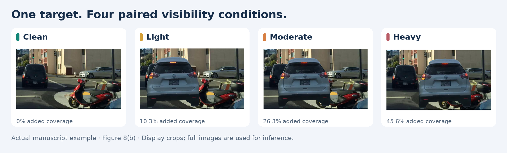
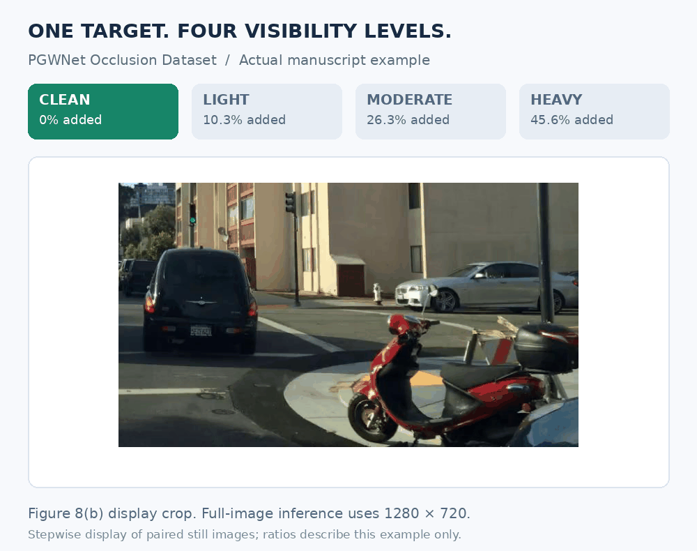
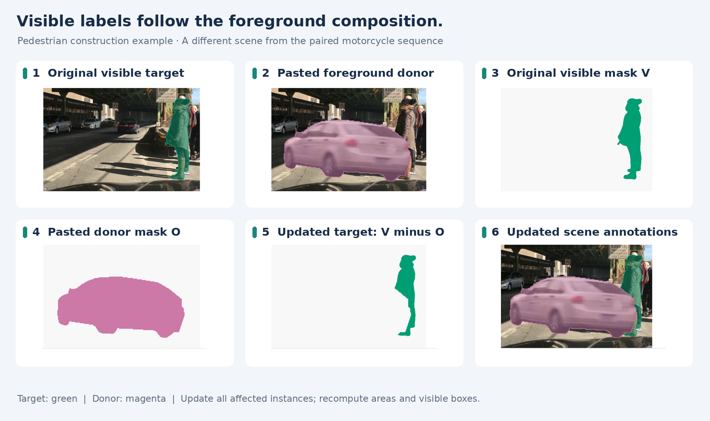
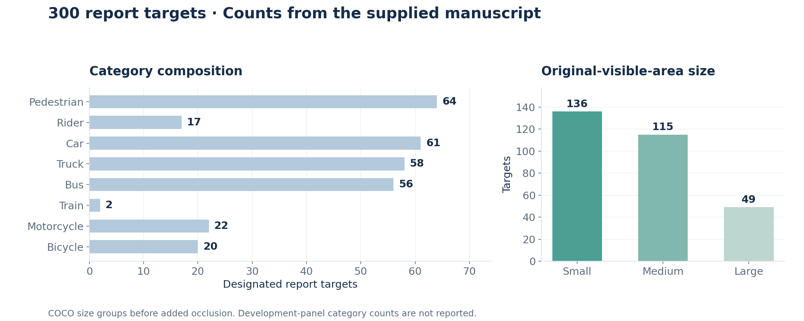
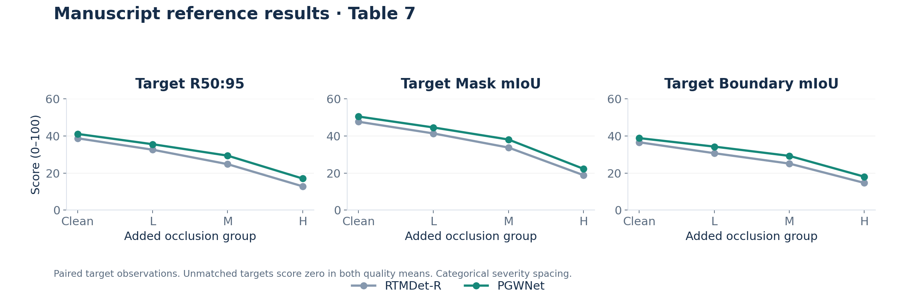

<div align="center">

# PGWNet Occlusion Dataset

**Paired foreground occlusion for traffic instance segmentation**

300 report targets &nbsp; · &nbsp; 60 development targets &nbsp; · &nbsp; 4 paired views &nbsp; · &nbsp; 8 categories

[**Download Dataset**](https://pan.baidu.com/s/16LGOrJ3Cfab2XgAQDZbw0A?pwd=qpst) &nbsp; | &nbsp; [Quick Start](#quick-start) &nbsp; | &nbsp; [Construction](#construction) &nbsp; | &nbsp; [Reproducibility](#reproducibility) &nbsp; | &nbsp; [Evaluation](#evaluation) &nbsp; | &nbsp; [Citation](#citation)



</div>

The **PGWNet Occlusion Dataset** follows the same traffic instance as a foreground object covers progressively more of its visible region. Each target has a clean view and three occluded views. The target, donor identity and donor scale stay fixed; donor translation changes the amount of coverage. Instance annotations are updated with each composite so that the ground truth describes what remains visible.

The dataset supports two related measurements: whether a model still recovers the designated instance, and how accurately it segments the surviving region and its boundary. Construction and inference use complete **1280 × 720** images. The crops above are for presentation.

This repository documents the controlled validation experiment in **Section 4.4** of *PGWNet: Progressive Gated Wavelet Fusion and Boundary-Aware Mask Supervision for Traffic Instance Segmentation*.

## Download

| Resource | Access |
| :--- | :--- |
| Dataset archive | [**Download Dataset (.zip)**](https://pan.baidu.com/s/16LGOrJ3Cfab2XgAQDZbw0A?pwd=qpst) |
| Access code | **`qpst`** |
| Construction and evaluation protocol | Documented below |
| Dataset construction code | [Occlusion-only entry point](generation_code/build_occlusion_only.py) · [Frozen partitions](generation_code/partitions.json) |

Download the dataset archive using the link above. Use access code `qpst` if prompted. The construction sources, frozen partitions and audit tools are included in this repository.

## Quick start

```bash
git clone https://github.com/gmy-c/pgwnet-occlusion-dataset.git
cd pgwnet-occlusion-dataset
python -m venv .venv
source .venv/bin/activate
python -m pip install -r requirements.txt
python tools/verify_provenance.py
```

After extracting the dataset, set `--root` to the directory containing its `annotations`, `manifests`, `images` and `partitions.json`:

```bash
python tools/audit_dataset.py \
  --root data/occlusion --require-paper-counts \
  --out outputs/archive-audit.json

python tools/visualize_dataset.py \
  --root data/occlusion --split report --crop \
  --out outputs/paired-example.png
```

The second command selects the first report target; add `--image-id ID` for a particular source image. Omit `--crop` to show full-image views. See [Quick start](docs/QUICKSTART.md) for source-data reconstruction and prediction export.

## Dataset design

The source is the **BDD100K instance-segmentation validation pool**, with visible instance masks for eight traffic categories. The report panel contains **300 source–target pairs**. A separate **60-target development panel** was used during development; the target sets and donor pools are disjoint between the two panels.

Each report target contributes four observations:

| View | Added occlusion ratio | Interpretation |
| :--- | :--- | :--- |
| Clean | 0% | Original image, with no added foreground occlusion |
| Light (L) | [10%, 25%) | Low added coverage |
| Moderate (M) | [25%, 45%) | Intermediate added coverage |
| Heavy (H) | [45%, 65%] | High added coverage |

The report panel therefore contains **1,200 target-view records: 300 targets × 4 views**. The views are paired observations of 300 targets. This count does not specify the number of unique source scenes or image files.

“Clean” means zero **added** occlusion; the source scene may already contain natural occlusion. Severity intervals define reporting groups, rather than a uniform sampling distribution. Donor translation can cover different pixels at each level, so the covered regions need not be nested.

The motorcycle example above has realized ratios of **0%, 10.3%, 26.3% and 45.6%**. These values belong to one illustrative sequence, rather than the group averages.

<details>
<summary><strong>View the paired sequence as an animation</strong></summary>



The animation steps through four still images from Figure 8(b). It does not represent a video recording or physical motion.

</details>

## Construction

### 1. Define coverage on the original visible mask

Let **V** be the target's original visible mask and **O** the pasted foreground donor mask, expressed in destination-image coordinates. Added occlusion and the updated visible target are

$$
r_{\mathrm{added}} = \frac{|V \cap O|}{|V|},
\qquad
G = V \setminus O.
$$

Here, $|\cdot|$ denotes pixel area. The denominator is the target area visible in the source image. No hidden or amodal shape is inferred. The same original mask **V** is the reference for all three occluded views.

### 2. Build the paired views

Select a target from the source image and a foreground donor from another image. Keep the target identity, donor identity and donor scale fixed across L/M/H. Translate the donor to obtain increasing added coverage within the specified intervals. Each view is a full-image foreground composite, with its own realized ratio computed from the mask intersection.

This pairing keeps the object being evaluated constant while changing foreground coverage. It also makes the transformation explicit: the donor placement and its intersection with the original visible mask determine the severity of each view.

### 3. Update the entire scene annotation



The pedestrian example from Figure 8(a) shows the annotation update. **Green** marks the target; **magenta** marks the donor. It is a different source scene from the motorcycle sequence.

For each original instance mask $V_j$, apply

$$
G_j = V_j \setminus O.
$$

Then:

1. Replace every affected original instance mask with its remaining visible pixels.
2. Remove instances whose updated masks are empty.
3. Add the pasted donor as a visible foreground instance.
4. Recompute areas and tight bounding boxes from the updated visible masks.
5. Preserve the source-to-generated annotation mapping used to track the designated target.

Updating all affected instances keeps the complete scene consistent with the composite. The designated target is followed through its annotation mapping, rather than rediscovered from its position or a visualization color. All mask operations are performed before any display crop.

## Composition



The report panel includes pedestrian **64**, rider **17**, car **61**, truck **58**, bus **56**, train **2**, motorcycle **22** and bicycle **20** targets. These counts sum to 300 and remain the same across the four views.

Size groups are assigned once, using the original visible target area **before** added occlusion:

| Size | Original visible area $A$ | Targets |
| :--- | :--- | ---: |
| Small | $A < 32^2$ | 136 |
| Medium | $32^2 \leq A < 96^2$ | 115 |
| Large | $A \geq 96^2$ | 49 |
| **Total** | | **300** |

The counts describe the report panel. The manuscript does not provide the development panel's category breakdown. The frozen constructor uses disjoint source-image ID pools for development, report and donors; their exact membership is included in the published partitions.

## Reproducibility

### Rebuild from the frozen source pool

The construction code fixes the source-image partitions, donor pools, target ordering and donor-search seed. Replay requires the original **998-image BDD8 validation COCO input**, including all candidate and donor images. Keep its image, annotation and category IDs, mask representation and annotation order. The nominal BDD100K validation split has 1,000 images; the author input used by the frozen builder contains 998 records.

```bash
python tools/build_dataset.py \
  --ann /path/to/ins_seg_val_coco_bdd8_exists.json \
  --images /path/to/BDD100K/10k/val \
  --out data/rebuilt-occlusion \
  --verify-source-hash \
  --audit
```

The output directory must not exist. The wrapper checks frozen IDs, source dimensions and the recorded annotation hash before invoking the dataset-only adapter. It then records source-file hashes, the actual library environment and the command used. With `--audit`, it checks the generated labels and donor-pixel compositions against the original sources.

The adapter builds **60 development and 300 report targets**, with clean/L/M/H for each. It does not generate the historical project's appearance, compound or training datasets. Generated views are lossless PNGs; clean files are copied from the source. The outputs include full-scene COCO annotations, six construction manifests, frozen partitions and a build receipt. See [Data format](docs/DATA_FORMAT.md) for paths and fields.

### How deterministic placement works

Targets are ordered within category by a hash key and selected in round-robin category order, with at most one target per source image. A target-specific NumPy `RandomState` is seeded from the historical protocol version, fixed seed namespace, split and original target annotation ID.

For each target, the constructor tries up to 100 donors. It resizes one donor using nearest-neighbor interpolation for masks and bilinear interpolation for pixels, fixes its vertical placement, and searches up to 100 horizontal positions for a complete L/M/H trajectory. Each view must retain at least 64 visible target pixels. Only a donor that admits all three levels is accepted. The exact seed function, scale ranges, ordering and rejection rules are documented in [Construction](docs/CONSTRUCTION.md) and implemented in the [active adapter](generation_code/build_occlusion_only.py).

### Audit the saved construction

The manifests retain source and donor IDs, scale, translation, original target mask **V**, donor mask **O**, realized coverage, per-instance area changes, target annotation mapping and generated-image hashes. These are actual constructor fields, rather than an example schema.

The audit checks cross-level identity and coverage, every surviving or removed instance, donor annotations, areas, tight boxes, split isolation, image hashes and unchanged background pixels. Supplying the source inputs also reconstructs the donor mask and pasted pixels:

```bash
python tools/audit_dataset.py \
  --root data/occlusion \
  --source-ann /path/to/ins_seg_val_coco_bdd8_exists.json \
  --source-images /path/to/BDD100K/10k/val \
  --require-paper-counts \
  --out outputs/source-replay-audit.json
```

### Paper standard and source provenance

The active implementation uses the manuscript intervals, including **45% ≤ r ≤ 65% for H**. The archived historical builder used an exclusive upper bound. Its seven runtime scripts remain unchanged and match the author-supplied SHA-256 receipts. The active adapter changes that endpoint; its remaining triplet logic matches the historical function at the AST level. A placement at exactly 65% can therefore differ from the historical output. See [Provenance](docs/PROVENANCE.md).

The repository checks exercise the actual adapter function on synthetic inputs, including full-scene label updates and pixel replay. They also cover the target evaluator's matching rules and boundary implementation:

```bash
python tools/verify_provenance.py
python -m unittest discover -s tests -v
```

The [validation record](docs/TESTING.md) covers source provenance and synthetic protocol tests. It does not certify a byte-identical rebuild of the shared archive or a reproduction of Table 7. Exact historical replay also requires the original library versions, which were not pinned in the supplied bundle.

## Evaluation

Run the model on the **complete image**, then match its predictions against **all scene instances**, including the donor and non-target objects. Only the designated targets contribute to the reported summaries. Ground-truth crops and clipping predictions to a ground-truth region are excluded from this protocol.

The repository includes a [target evaluator](tools/evaluate_targets.py) for exported, postprocessed predictions:

```bash
python tools/evaluate_targets.py \
  --root data/occlusion --split report --level H \
  --predictions outputs/predictions_H.json \
  --out outputs/metrics_H.json
```

Each prediction requires `image_id`, `category_id`, `score`, the model's COCO `bbox`, and a full-resolution binary mask RLE. Repeat for clean/L/M/H with the corresponding predictions. Model inference and weights belong to the separate model project; this tool consumes its outputs. See [Evaluation](docs/EVALUATION.md) for the export contract and implementation details.

### Fixed prediction settings

| Setting | Value |
| :--- | ---: |
| Image resolution | 1280 × 720 |
| Mask binarization threshold | 0.50 |
| NMS IoU threshold | 0.60 |
| Pre-NMS prediction limit | 1,000 |
| Inference score floor | 0.05 |
| Maximum output instances | 100 |
| Confidence retained for target evaluation | ≥ 0.30 |

Predictions are processed in descending confidence order. Score ties keep the original output order; equal-IoU ground-truth choices use the smaller annotation ID.

### Two matching paths

| Path | Association rule | Reported measures |
| :--- | :--- | :--- |
| Target recovery | One-to-one same-class **mask-IoU** matching, repeated independently at each threshold | R50, R75 and R50:95 |
| Visible-region quality | A separate one-to-one same-class **box-IoU ≥ 0.50** association | Mask mIoU and Boundary mIoU |

For recall, each prediction takes the highest-mask-IoU unmatched same-class instance that meets the threshold. This path has no preliminary box-IoU gate.

For the quality measures, each prediction takes the unmatched same-class instance with the highest box IoU, requiring at least 0.50. Ground-truth boxes are recomputed from the current visible masks. The same associated prediction mask supplies both quality scores, with no additional mask-IoU filter. **Unmatched targets receive zero in both means.**

All summaries use the same **300 designated targets per view**. R50:95 averages recall over ten thresholds from 0.50 to 0.95 in steps of 0.05, at the fixed confidence and output limits above. Mask mIoU and Boundary mIoU average over all targets, including unmatched ones, without category averaging or pixel pooling.

<details>
<summary><strong>Metric definitions and boundary implementation</strong></summary>

With $N = 300$ and $m_i(\tau)$ indicating whether target $i$ is recovered at threshold $\tau$:

$$
R_\tau = \frac{1}{N}\sum_{i=1}^{N}m_i(\tau),
\qquad
R_{50:95} = \frac{1}{10}\sum_{k=0}^{9}R_{0.50+0.05k}.
$$

For a binary mask $M$, define the internal boundary band

$$
\partial_d M = M \setminus \operatorname{erode}(M,d).
$$

Then

$$
\operatorname{BIoU}(P,G) =
\frac{|\partial_d P \cap \partial_d G|}
{|\partial_d P \cup \partial_d G|},
\qquad
d = \max\!\left(1,\operatorname{round}\!\left(0.005\sqrt{H^2+W^2}\right)\right).
$$

At 1280 × 720, **d = 7**. Erosion applies a 3 × 3 kernel seven times with zero padding and retains all connected components. Compute both metrics on full-resolution masks before any display crop.

For associated target $i$, let $s_i = \operatorname{IoU}(P_i,G_i)$ and $b_i = \operatorname{BIoU}(P_i,G_i)$; set both to zero if the target is unmatched. The reported quality means are

$$
\operatorname{Mask\ mIoU} = \frac{1}{N}\sum_{i=1}^{N}s_i,
\qquad
\operatorname{Boundary\ mIoU} = \frac{1}{N}\sum_{i=1}^{N}b_i.
$$

Multiply recall and quality means by 100 for reporting. R50:95 is a target recall average under this protocol, rather than Mask AP or official COCO AR.

</details>

## Reference results

The following scores are reported in **Table 7 of the companion manuscript**, on a 0–100 scale. They are reference results, rather than measurements produced by this documentation release.



| View | Method | R50 | R75 | R50:95 | Mask mIoU | Boundary mIoU |
| :--- | :--- | ---: | ---: | ---: | ---: | ---: |
| Clean | RTMDet-R | 58.33 | 41.33 | 38.77 | 47.72 | 36.61 |
| Clean | **PGWNet** | **62.00** | **43.00** | **41.13** | **50.53** | **38.86** |
| Light | RTMDet-R | 51.67 | 35.00 | 32.60 | 41.39 | 30.72 |
| Light | **PGWNet** | **55.00** | **38.33** | **35.57** | **44.62** | **34.28** |
| Moderate | RTMDet-R | 43.33 | 26.67 | 24.80 | 33.77 | 25.11 |
| Moderate | **PGWNet** | **47.33** | **31.33** | **29.40** | **38.11** | **29.28** |
| Heavy | RTMDet-R | 24.67 | 10.33 | 12.83 | 18.87 | 14.68 |
| Heavy | **PGWNet** | **30.33** | **18.33** | **17.03** | **22.29** | **18.03** |

Lines connect summaries of the same targets across categorical severity groups. Equal horizontal spacing does not imply equal increments in realized occlusion. Both models lose accuracy as coverage increases; under heavy occlusion, PGWNet's R75 is 18.33, showing that high-overlap recovery remains difficult.

## Intended use and scope

Use this panel to compare fixed model checkpoints under controlled foreground coverage, inspect failure cases on paired views, and measure remaining-mask and boundary quality alongside whole-scene AP.

The panel derives from the source validation pool used during model development. Its category counts are uneven, particularly the two train targets. Target-conditioned summaries do not fully penalize background false positives, and box association affects the quality means. The reported comparisons concern synthetic visibility changes on these targets; broader natural-occlusion performance and variation across retraining require separate evaluation.

## Repository guide

| Location | Contents |
| :--- | :--- |
| [generation_code](generation_code) | Active construction adapter, frozen partitions, original sources and hash receipts |
| [tools](tools) | Preflight builder, provenance checks, annotation and pixel audit, visualization and target evaluation |
| [docs](docs) | Construction details, quick start, actual data format, evaluation and validation record |
| [assets](assets) | Real manuscript examples, paired animation and data/result charts |
| [metadata](metadata) | Paper statistics, reference scores, source-bundle provenance and download information |
| [tests](tests) | Synthetic tests of construction, auditing and evaluation behavior |

## Citation

If you use the controlled occlusion panel or its protocol, cite the companion manuscript and the underlying BDD100K dataset.

```bibtex
@misc{gong_pgwnet_submission,
  author = {Gong, Mingyu and Chen, Gengbiao and Zhang, Jinlai and Li, Yucheng},
  title = {{PGWNet}: Progressive Gated Wavelet Fusion and Boundary-Aware
           Mask Supervision for Traffic Instance Segmentation},
  year = {2026},
  note = {Unpublished manuscript; controlled occlusion evaluation in Section 4.4}
}

@inproceedings{yu2020bdd100k,
  author = {Yu, Fisher and Chen, Haofeng and Wang, Xin and Xian, Wenqi
            and Chen, Yingying and Liu, Fangchen and Madhavan, Vashisht
            and Darrell, Trevor},
  title = {{BDD100K}: A Diverse Driving Dataset for Heterogeneous Multitask Learning},
  booktitle = {Proceedings of the IEEE/CVF Conference on Computer Vision
               and Pattern Recognition},
  year = {2020}
}
```

The manuscript citation will be updated when a public publication identifier is available.

## Provenance and contact

The construction and paired-view illustrations use actual samples from **Figure 8(a–b)** of the companion manuscript. Distribution plots use its reported counts; the result plot and table reproduce **Table 7**. The animation reuses the four illustrated stills. These assets show the documented experiment and do not replace full-resolution data or construction records.

See the [BDD100K project](https://github.com/bdd100k/bdd100k) for the source dataset and its data terms, and the [Boundary IoU project](https://github.com/bowenc0221/boundary-iou-api) for the underlying boundary metric. Data and code terms are documented in [DATA_LICENSE.md](DATA_LICENSE.md).

**Maintainer:** Mingyu Gong · [gongmingyu@stu.csust.edu.cn](mailto:gongmingyu@stu.csust.edu.cn)

For questions about the dataset or release records, [open an issue](https://github.com/gmy-c/pgwnet-occlusion-dataset/issues).
